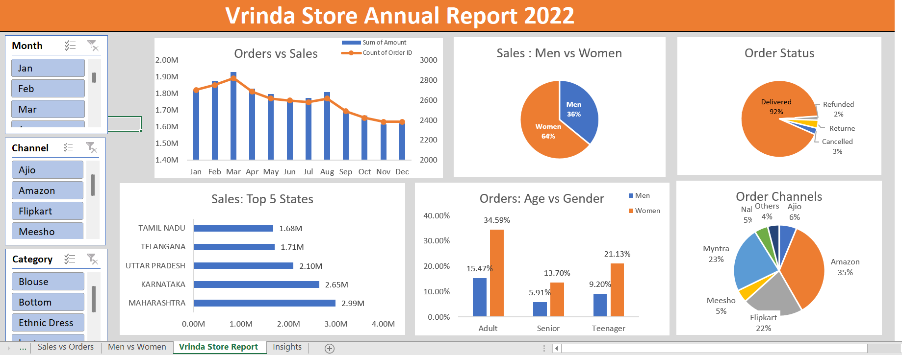

# 📊 Vrinda Store Annual Report 2022 – Excel Dashboard

This project presents a complete **annual sales analysis** of *Vrinda Store* for 2022 using **Microsoft Excel**.  
The dashboard highlights customer behavior, sales performance, top locations, and order channels using interactive visuals and slicers.

---

## 🚀 Dashboard Highlights
- 📈 **Orders vs Sales Trend** (Month-wise)
- 👨‍🦰👩‍🦰 **Sales: Men vs Women**
- 🛍 **Order Status** (Delivered, Return, Cancelled, Refunded)
- 🏆 **Top 5 States by Sales**
- 👥 **Orders: Age vs Gender**
- 🛒 **Order Channels Contribution**
- 🔄 **Slicers for Month, Category & Channel**

---

## 🛠 Tools & Techniques Used
- **Microsoft Excel**
- Pivot Tables & Pivot Charts  
- Data Cleaning Techniques  
- Interactive Slicers  
- Excel Formatting & Styling  
- Trend & Category Analysis  

---

## 📚 Key Insights
> ✔ **Women purchase more than men** (≈ 65%)  
> ✔ **Top 3 states:** Maharashtra, Karnataka, Uttar Pradesh  
> ✔ **Adult age group (30–49 yrs)** contributes the highest (~50%)  
> ✔ **Top sales channels:** Amazon, Flipkart, Myntra  

---

## 🎯 Final Business Recommendation
To boost Vrinda Store’s overall sales:

> **Target women (30–49 yrs) in Maharashtra, Karnataka, and Uttar Pradesh**  
> by running targeted ads, offers, and coupons on top-performing channels —  
> **Amazon, Flipkart, and Myntra**.

This segment has the **highest conversion potential** and can significantly increase revenue.

---

## 📁 Project Files
- `Vrinda_Store_Annual_Report_2022.xlsx` → Full Excel dashboard  
- `dashboard_preview.png` → Dashboard preview  

---

## 🎓 Learning Outcomes
- Data cleaning & preparation  
- Pivot-based analytics  
- Creating dynamic dashboards in Excel  
- Business insight generation  
- Data storytelling  

---

## 👤 Author
**Rupesh Gupta**  
Data Analyst | Excel • SQL • Power BI  
📧 rupeshg1960@gmail.com  
🔗 GitHub: https://github.com/rupeshg27
